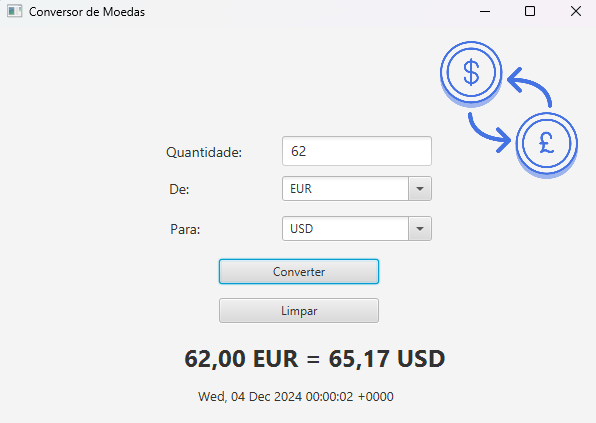

<h1 align="left">Conversor de Moedas</h1>

###

###

<h2 align="left">Sobre o projeto</h2>

###

Este projeto é um conversor de moedas desenvolvido em Java com JavaFX. Ele permite converter valores entre diferentes moedas usando taxas de câmbio em tempo real obtidas de uma API externa.

###

<h2 align="left">Funcionalidades</h2>

###

* Conversão de moedas em tempo real. * Interface gráfica intuitiva. * Integração com a API ExchangeRate-API.

###

<h2 align="left">Estrutura do Projeto:</h2>

###

Controller: Controla a lógica de conversão e a interação com a interface. Model: Representa os dados das moedas e as operações de cálculo. DAO: Responsável pela recuperação e processamento das informações da API. View: Interface gráfica desenvolvida com JavaFX.

###

<h2 align="left">Tecnologias Utlizadas</h2>

###

Java JavaFX JSON (para manipulação de dados da API) Gson Scene Builder

###

<h2 align="left">Como Executar:</h2>

###

1. Clone o repositório: git clone https://github.com/alessandrooCosta/Conversor-de-Moedas.git 2. Importe o projeto em uma IDE como IntelliJ ou Eclipse. 3. Certifique-se de ter o Java 11+ instalado. 4. Execute a classe principal.

###

<h2 align="left">Capturas de tela</h2>

###

  

###

<h2 align="left">Resultado:</h2>

###

